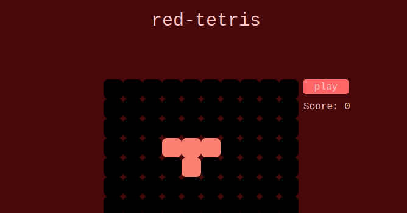

# red-tetris

The objective of this project is to develop a networked multiplayer tetris  
game from a stack of software exclusively Full Stack TypeScript.



## Full Stack TypeScript

- [![NodeJs][nodeJS-shield]][nodeJS-URL]
- [![react-router][react-router-shield]][react-router-URL]
- [![redux][redux-shield]][redux-URL]
- [![TailwindCSS][tailwind-shield]][tailwind-URL]
- [![Socket.io][socket.io-shield]][socket.io-URL]

## Pedagogical Objectives

The pedagogical objectives are multiple, but the main axis is to introduce the language  
TypeScript, to discover its abundant ecosystem and to implement some of the principles,  
techniques and Flagship tools of Full Stack TypeScript.

## The Tetris Game

You have access to two game modes. A mode "solo" and a mode "multiplayer".  
The solo mode is the classic Tetris. A terrain consists of 10 columns and 20 lines. You score for every piece that you place and for every line that you complete.  
The multiplayer mode is based on the same basics but is played between several players. Each player has his own playing field, all players undergo the same series of pieces.  
As soon as a player destroys lines on his ground, the opposing players receive n - 1 lines in penalty, then indestructible, which fit at the bottom of their playground.  
Each player can graphically observe the specter of their opponents land. A spectrum indicates a current terrain without its current piece.  
As soon as the terrain is updated, (when the current piece is fixed to the terrain), all opponents must visualize the evolution of their spectrum.

## Frontend

As the frontend should use the fonctional style only, I find convinient the use or React and as I have worked professionaly the past months with react-router, I decided de go for it.  
For the store, the project forces you to use Redux even tho Zustand is the better option today, IMO.
I have not looked into adding an http service for the frontend to the backend.
It is currently served with Vite.js.

## Backend

The server is using NodeJs and Socket.io. At the moment, the backend only offers a web-socket service that manages game rooms, pieces and game views.

## Usage

You need to have `ts-node` installed on you machine.  
Run the frontend with:

```bash
cd frontend-v2
pnpm install
pnpm dev
```

Run the backend with:

```bash
cd backend
pnpm install
pnpm dev
```

## Contribution and more

If you would like to contribute to the project, use pull requests.  
If you want to contact me with 42's slack: vcornill  
Else:

- <a href="https://www.linkedin.com/in/victorcornille/">LinkedIn</a>
- victor.cornille@gmail.com

[nodeJS-shield]: https://img.shields.io/badge/node.js-339933?style=for-the-badge&logo=Node.js&logoColor=white
[nodeJS-URL]: https://nodejs.org
[react-router-shield]: https://img.shields.io/badge/-React%20Router-CA4245?logo=react-router
[react-router-URL]: https://reactrouter.com/
[socket.io-shield]: https://img.shields.io/badge/Socket.io-4.1.3-010101??style=flat-square&logo=Socket.io&logoColor=white
[socket.io-URL]: https://socket.io/
[redux-URL]: https://redux.js.org/
[redux-shield]: https://img.shields.io/badge/redux-764ABC?style=for-the-badge&logo=redux&logoColor=white
[tailwind-shield]: https://img.shields.io/badge/Tailwind_CSS-grey?style=for-the-badge&logo=tailwind-css&logoColor=38B2AC
[tailwind-URL]: https://tailwindcss.com/
